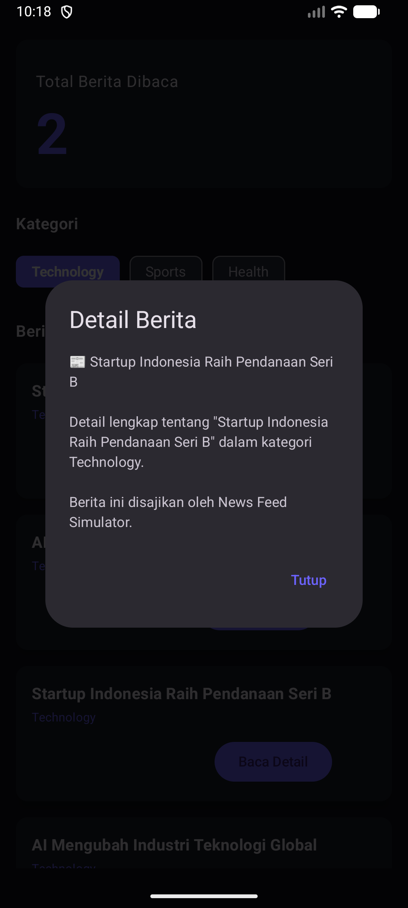
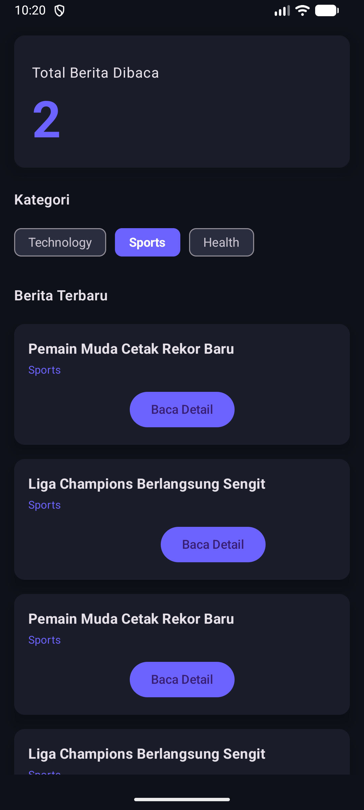

# News Feed Simulator

---

## Identitas Mahasiswa

- Nama  : Prima Agusta Sembiring
- NIM   : 123140119

---

# Fitur Utama

- Flow menghasilkan berita setiap 2 detik
- Filter berita berdasarkan kategori
- Transformasi data menggunakan Flow Operators
- StateFlow untuk menghitung berita yang dibaca
- Async/Await untuk detail berita
- Error Handling
- Dark Modern UI

---

# 🧠 Implementasi Code

---

### Flow Builder

```kotlin
fun getNewsStream(): Flow<News> = flow {
    while (true) {
        delay(2000)
        emit(news)
    }
}
```

### Emit Data

```kotlin
emit(news)
```

### Collect di ViewModel

```kotlin
.collect()
```

Penjelasan:
Flow digunakan untuk menghasilkan data berita baru setiap 2 detik secara reactive.

---

## Penggunaan Flow Operators

### filter()

```kotlin
.filter { it.category == selectedCategory }
```

### map()

```kotlin
.map { it.copy(title = "🔥 ${it.title}") }
```

### onEach()

```kotlin
.onEach { _newsList.value += it }
```

### catch() (Error Handling)

```kotlin
.catch { e ->
    println("Error: ${e.message}")
}
```

Penjelasan:
Operator digunakan untuk memfilter kategori, mentransformasi data, dan menangani error.

---

## StateFlow Implementation

### StateFlow untuk daftar berita

```kotlin
private val _newsList = MutableStateFlow<List<News>>(emptyList())
val newsList: StateFlow<List<News>> = _newsList
```

### StateFlow untuk jumlah berita dibaca

```kotlin
private val _readCount = MutableStateFlow(0)
val readCount: StateFlow<Int> = _readCount
```

Penjelasan:
StateFlow digunakan untuk mengelola state aplikasi secara reactive.

---

## Coroutines Usage 

### ✔ viewModelScope.launch

```kotlin
viewModelScope.launch {
    ...
}
```

### async / await

```kotlin
val result = async(Dispatchers.IO) {
    repository.getNewsDetail(news)
}.await()
```

Penjelasan:
Coroutines memungkinkan pengambilan data berjalan asynchronous tanpa blocking UI.

---

## Unit Test Flow

```kotlin
@Test
fun testFlowEmitsData() = runTest {
    val news = repository.getNewsStream().first()
    assertNotNull(news)
}
```

## Unit Test Coroutine

```kotlin
@Test
fun testGetDetail() = runTest {
    val detail = repository.getNewsDetail(news)
    assertTrue(detail.contains("Detail"))
}
```

## Error Handling

```kotlin
.catch { e ->
    println("Error: ${e.message}")
}
```

---

# Screenshot Aplikasi

---

## 🔹 Tampilan Utama

> Tambahkan screenshot di folder `screenshots/` lalu masukkan di sini.

```markdown

```

---
## 🔹 Detail Berita

```markdown

```

## 🔹 Tampilan Utama

```markdown

```


